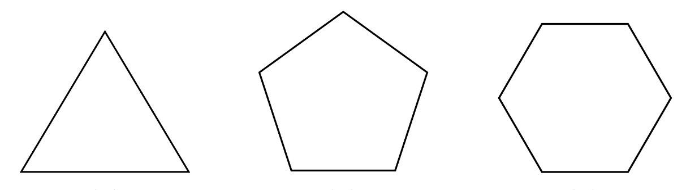

# The Spirals

## Initial tutorial

First, get some numbers, lets go all way and get `360` of them:

<f-array-data length="360">
  <pre slot-scope="data" style="height: 8rem">{{data}}</pre>
</f-array-data>

---

Let's put them on `two-scene`:

<f-array-data :length="360">
  <f-scene slot-scope="data">
    <f-grid />
    <f-circle v-for="(_,i) in data.value"
      :x="cx(i,1)"
      :y="cy(i,1)"
      r="0.02"
    />
  </f-scene>
</f-array-data>

---

Great, we have the circle, made of `360` points. Now lets try to make a spiral.

For each point we draw, we reduce a radius (previously always `1`) to a small extent. To help with calculations, lets use `scale()` function:

```
scale(i,0,360-1,1,0)   
```

where 

`i` current point index
`0` first point index
`360-1` last point index
`1` max radius (outer y coordinate) of the spiral
`0` min radius (centerpoint y coordinate)

---

Lets experiment with **one** `:length="360"` and **three** `:length="360*3"` rotations:

<f-array-data :length="360">
  <f-scene slot-scope="data">
    <f-grid />
    <circle v-for="(_,i) in data.value"
      :cx="cx(i,scale(i,0,360-1,1,0))"
      :cy="cy(i,scale(i,0,360-1,1,0))"
      r="0.02"
    />
  </f-scene>
</f-array-data>

<f-array-data :length="360*3">
  <f-scene slot-scope="data">
    <f-grid />
    <f-circle v-for="(_,i) in data.value"
      :x="cx(i,scale(i,0,(360*3)-1,1,0))"
      :y="cy(i,scale(i,0,(360*3)-1,1,0))"
      r="0.02"
    />
  </f-scene>
</f-array-data>

---

Lets got back to the original circle. We generated `360` points but do we really need that many? Lets to way less points, say `360 / 10 = 36`and try to make a path connecting them.

First, the points:

<f-array-data :length="360/10">
  <f-scene slot-scope="data">
    <f-grid />
    <f-circle v-for="(_,i) in data.value"
      :x="cx(i*10,1)"
      :y="cy(i*10,1)"
      r="0.02"
    />
  </f-scene>
</f-array-data>

---

Nice, but how do we connect them? d3 module offers a function `d3.line()([[0,0],[1,1]])` that generates a SVG `path` string in between coordinates `0,0` and `1,1`.

<f-array-data :length="360/10">
  <f-scene slot-scope="data">
    <f-grid />
    <f-circle v-for="(_,i) in data.value"
      :x="cx(i*10,1)"
      :y="cy(i*10,1)"
      r="0.02"
    />
    <path
    :d="d3.line()([[0,0],[1,1]])"
      stroke="black"
    />
  </f-scene>
</f-array-data>

---

Instead of dummy `[[0,0],[1,1]]` coordinates, lets pass our circle points instead. We need to *map* our `data.value` array (currently filled with `0`) to our circle points, so
```
data.value.map((v,i) => [cx(i*10,1),cy(i*10,1)])
```
So we get this:

<f-array-data :length="360/10">
  <f-scene slot-scope="data">
    <f-grid />
    <f-circle v-for="(_,i) in data.value"
      :cx="cx(i*10,1)"
      :cy="cy(i*10,1)"
      r="0.02"
    />
    <path :d="d3.line()(data.value.map((v,i) => [cx(i*10,1),cy(i*10,1)]))"       
      fill="none"
      stroke="black"
    />
  </f-scene>
</f-array-data>

---

Great, but there is one minor annoyance. We have repeated our `cx / cy` calculations two times. Instead duplicating code, let do our calclulations while initializing `<f-array-data>`. There is a `:map` prop where we can pass in a function so we can use pre-generated coordinates in many places:

<f-array-data :length="360/10" :map="(v,i) => ([cx(i*10,1),cy(i*10,1)])">
  <f-scene slot-scope="data">
    <f-grid />
    <f-circle v-for="d in data.value"
      :x="d[0]"
      :y="d[1]"
      r="0.02"
    />
    <f-circle v-for="d in data.value"
      :x="d[0]"
      :y="d[1]"
      r="0.1"
      fill="none"
      stroke="var(--red)"
    />
    <path :d="d3.line()(data.value)"       
      fill="none"
      stroke="black"
    />
  </f-scene>
</f-array-data>

---

Lets get now back to our spiral. Lets add our radius scaling function `scale(i,0,360/10-1,1,0)` to `:map` so we will get our spiral, but now as a path (not as a huge set of points as previously).

<f-array-data :length="360/10" :map="(_,i) => ([cx(i * 10,scale(i,0,360/10-1,1,0)),cy(i * 10,scale(i,0,360/10-1,1,0))])">
  <f-scene slot-scope="data">
    <f-grid />
    <f-circle v-for="d in data.value"
      :x="d[0]"
      :y="d[1]"
      r="0.02"
    />
    <path
      :d="d3.line()(data.value)"
      fill="none"
      stroke="black"
    />
  </f-scene>
</f-array-data>

---

Finally, add some more spin to it!

<f-animation-data from="1" to="10" value="1" alternate="true">
<f-array-data slot-scope="sData" :length="(360 * sData.value) / 10" :map="(_,i) => ([cx(i * 10,scale(i,0,(360 * sData.value)/10-1,1,0)),cy(i * 10,scale(i,0,(360 * sData.value)/10-1,1,0))])">
  <f-scene slot-scope="data">
    <f-grid />
    <f-circle v-for="d in data.value"
      :x="d[0]"
      :y="d[1]"
      r="0.02"
    />
    <path
      :d="d3.line()(data.value)"
      fill="none"
      stroke="black"
    />
  </f-scene>
</f-array-data>
</f-animation-data>

---

Now, if you look very closely our spiral is not really a *curve*, our control points are connected with a straight *lines*. Lets reduce the amount of control points to `360/30 = 12` to see this in effect:

<f-array-data :length="360/30" :map="(_,i) => ([cx(i * 30,scale(i,0,360/30-1,1,0)),cy(i * 30,scale(i,0,360/30-1,1,0))])">
  <f-scene slot-scope="data">
    <f-grid />
    <f-circle v-for="d in data.value"
      :x="d[0]"
      :y="d[1]"
      r="0.02"
    />
    <path
      :d="d3.line()(data.value)"
      fill="none"
      stroke="black"
    />
  </f-scene>
</f-array-data>

---

So we need a curve. Luckily `d3.line()` provides that option, by setting `d3.line().curve(d3.curveCardinal.tension(0))` we get our curve. 

<f-array-data :length="360/30" :map="(_,i) => ([cx(i * 30,scale(i,0,360/30-1,1,0)),cy(i * 30,scale(i,0,360/30-1,1,0))])">
  <f-scene slot-scope="data">
    <f-grid />
    <f-circle v-for="d in data.value"
      :x="d[0]"
      :y="d[1]"
      r="0.02"
    />
    <path
      :d="d3.line().curve(d3.curveCardinal.tension(0))(data.value)"
      fill="none"
      stroke="black"
    />
  </f-scene>
</f-array-data>

---

Note that `.tension()` can have a wide range of values. `.tension(0)` gives us a curve, `.tension(1)` a straight line but you can really go to town with this:

<f-slider-data from="3" to="32" value="8" title="Control point count">
<f-slider-data from="-30" to="30" step="0.01" value="0" title="Tension"
slot-scope="sliderData">
<f-array-data
  slot-scope="sliderData2"
  :length="sliderData.value"
  :map="(_,i) => ([ cx(360 / sliderData.value * i, 1), cy(360 / sliderData.value * i, 1)])"
>
<f-scene slot-scope="arrayData">
  <f-grid />
  <f-circle
    v-for="d in arrayData.value"
    :x="d[0]"
    :y="d[1]"
    r="0.02"
  />
  <path
    stroke="var(--red)"
    opacity="0.7"
    fill="none"
    :d="
      d3.line()
        .curve(d3.curveCardinalClosed.tension(sliderData2.value))
        (arrayData.value)
    "
  />
  <f-circle
    r="1"
    fill="none"
    stroke="var(--primary)"
    opacity="0.5"
  >
</f-scene>
</f-array-data>
</f-slider-data>
</f-slider-data>

---

There is one more aspect on this. Interestingly, in `x y` coordinate space the spiral manifests itself as a *signal dampening*:

<f-array-data :length="360">
  <f-scene slot-scope="data">
    <f-grid />
    <f-circle v-for="(_,i) in data.value"
      :x="cx(i,scale(i,0,360-1,1,0))"
      :y="cy(i,scale(i,0,360-1,1,0))"
      r="0.02"
    />
  </f-scene>
</f-array-data>

<f-array-data :length="360*3">
  <f-scene slot-scope="data">
    <f-grid />
    <f-circle v-for="(_,i) in data.value"
      :y="cx(i,scale(i,0,(360*3)-1,1,0))"
      :y="cy(i,scale(i,0,(360*3)-1,1,0))"
      r="0.02"
    />
  </f-scene>
</f-array-data>

<br>

<f-array-data :length="360">
  <f-scene slot-scope="data">
    <f-grid />
    <f-circle v-for="(_,i) in data.value"
      :x="cx(i,scale(i,0,360-1,1,0))"
      :y="scale(i,0,360-1,1,0)"
      r="0.02"
    />
  </f-scene>
</f-array-data>

<f-array-data :length="360*3">
  <f-scene slot-scope="data">
    <f-grid />
    <f-circle v-for="(_,i) in data.value"
      :x="cx(i,scale(i,0,360*3-1,1,0))"
      :y="scale(i,0,360*3-1,1,0)"
      r="0.02"
    />
  </f-scene>
</f-array-data>

---

And now let's go to 3d:

<f-array-data :length="360" :map="(v,i) => ({x: cx(i*10,i/500), y: cy(i*10,i/500),z:i/500})">
  <f-scene3 slot-scope="data">
    <f-animation-data :to="deg2rad(360)"> 
      <f-group3
        slot-scope="aData"
        :rotation="{ y: aData.value }"
        :scaling="0.6"
      >
        <f-grid3 />
        <f-line3 :points="data.value"/>
      </f-group3>
    </f-animation-data>
  </f-scene3>
</f-array-data>

---

## Scenarios

### Scenario 1 : The clock spring

Clock springs are used in various applications in mechanical and electrical engineering.   They are also known as power strings.
This scenario focus on the design and construction of a specific type of spiral, the Archimedean spiral. An Archimedean spiral is a type of a spiral that has a fixed distance between its successive turns.

---


Helical compression springs can be designed as a typical 3D Archimedian spiral. This scenario implements the design and 3D printing of this spring.

---

### Scenario 3 : The sheet metal screw

Sheet metal screws make excellent fasteners for attaching metal hardware to wood because the fully threaded shank provides good retention in wood.

Has sharp threads that cut into a material such as sheet metal, plastic or wood. They are sometimes notched at the tip to aid in chip removal during thread cutting. The shank is usually threaded up to the head.

In terms of design, a deck screw is a combination of a 3D spiral and a cylinder. This scenario implements the design and 3D printing of a sheet metal screw.

---

# Discovering Spirals

Spiral is a very common shape in nature and in as well as every day life. In the natural world, we may find spirals in the DNA double helix, the fingerprint, the flowers, the snails and shells but also in the galaxies, the hurricanes etc. Even the shape of an egg can be seen as a special type of spiral.

<code>images...</code>

---

Spiral  patterns can be also met in parts of mechanical constructions, turbines, propellers, screws, drills, springs etc.

<code>images...</code>

---

Architects also use the spirals to shape buildings and components like stairs.

<code>images...</code>

---

Finally spiral shaped artworks, figures and artifacts are used in every day life objects, even in the  ancient time.

<code>images...</code>

---

## Activity

Watch the following videos about the spirals and try answer the questions in the following Worksheet.

[1. Spiral in Nature, 4.16′](https://www.youtube.com/watch?v=lPOf70xIJyg)
[2. Demo on Fibonacci Sequence Spirals in Nature – The Golden Ratio, 2.36′](https://www.youtube.com/watch?v=iEnR8zupK0A)
[3. Spiral shapes in nature, 2.33′](https://www.youtube.com/watch?v=GiSd2OrYP8s)
[4. Why Are Most Galaxies Spiral-Shaped?, 3.53′](https://www.youtube.com/watch?v=aIUu5uMKB70)

Download the following worksheet, answer the questions, print and submit it. 

---

## Practicing

### Archimedean spiral shapes. 

<code>spiral magic should happen...</code>

---

### 3D spirals

<code>3D spiral magic should happen...</code>

---

## Theory

### Basics of trigonometry, Polar coordinates

<code>Theory chunk</code>

--- 

### Mathematics of 2D and 3D Archimedian spirals

<code>Theory chunk</code>

---

<div class="button_primary">
  Geometry of triangles ➜
</div>



---


# Looking for triangles
 
Thank you!
